# BlueAlbum(项目施工中⚠️)

> 一个面向二次开发的在线论坛模板，目标是沉淀成类似“若依”的社区产品脚手架。

[](https://github.com/yourusername/BlueAlbum)
[](https://opensource.org/licenses/MIT)
[](https://spring.io/projects/spring-boot)
[](https://vuejs.org/)

BlueAlbum 希望解决的问题不是“再做一个论坛 Demo”，而是提供一个可复用、可裁剪、可持续扩展的论坛底座。你可以基于它快速搭一个技术社区、校园论坛、兴趣社区，或者继续往“带后台、带审核、带通知、带 AI”的社区产品方案演进。

## 架构图

```text
                         BlueAlbum 在线论坛模板

┌─────────────────────────────────────────────────────────────────┐
│                           Client Layer                          │
│  Web / H5 / 响应式页面                                           │
└─────────────────────────────────────────────────────────────────┘
                                │
                                ▼
┌─────────────────────────────────────────────────────────────────┐
│                        Frontend Layer                           │
│  Vue 3 + Vite + Tailwind CSS + Axios + Md-editor-v3            │
│  页面展示 / 状态管理 / 内容编辑 / 用户交互                        │
└─────────────────────────────────────────────────────────────────┘
                                │
                                ▼
┌─────────────────────────────────────────────────────────────────┐
│                         API Gateway Layer                       │
│  REST API / JWT 鉴权 / 上传接口 / AI 接口                        │
└─────────────────────────────────────────────────────────────────┘
                                │
                                ▼
┌─────────────────────────────────────────────────────────────────┐
│                        Backend Core Layer                       │
│  Spring Boot + Spring Security + MyBatis-Plus / JPA            │
│  用户体系 / 分区体系 / 帖子体系 / 评论体系 / 设置体系              │
└─────────────────────────────────────────────────────────────────┘
                                │
             ┌──────────────────┼──────────────────┐
             ▼                  ▼                  ▼
┌──────────────────┐  ┌──────────────────┐  ┌──────────────────┐
│   MySQL + Flyway │  │      Redis       │  │    RabbitMQ      │
│   核心业务数据     │  │ 缓存 / 限流 / 会话 │  │ 异步任务 / 事件流   │
└──────────────────┘  └──────────────────┘  └──────────────────┘
             │                  │                  │
             └──────────────┬───┴──────────────┬───┘
                            ▼                  ▼
                  ┌──────────────────┐  ┌──────────────────┐
                  │ 文件存储扩展层     │  │ AI / OAuth 扩展层 │
                  │ Local / S3 / OSS │  │ 摘要 / 对话 / 登录 │
                  └──────────────────┘  └──────────────────┘
```

这个架构的重点不是“复杂”，而是“能稳步扩”。基础论坛能力先跑通，增强能力再按模块往外长。

## 模板分层图

```text
L3 解决方案层
   管理后台 / 内容审核 / 通知中心 / AI 助手 / 多站点 / 多租户
   这一层决定它能否从“论坛模板”进化成“社区解决方案”

L2 通用能力层
   用户体系 / 分区体系 / 帖子体系 / 评论体系 / 上传体系 / 安全体系
   这是模板复用价值的核心，也是二次开发最常复用的部分

L1 基础运行层
   Vue 3 前端 / Spring Boot 后端 / MySQL / Redis / RabbitMQ / Docker
   这一层保证项目能开箱运行、能部署、能演示
```

也可以把它理解成三句话：

- L1 负责“跑起来”
- L2 负责“能复用”
- L3 负责“能商业化扩展”

## 为什么是它

- 开箱能跑：拉起前后端和基础依赖后，就能完成注册、登录、发帖、评论、浏览
- 适合二开：前后端分离、职责清晰，方便替换 UI、鉴权、存储、通知和 AI 能力
- 不止代码壳子：已经具备用户体系、内容体系、评论体系和基础安全能力
- 文档比较完整：设计、实施、测试、迁移、故障归档都已沉淀，适合继续模板化

## 适用场景

- 技术论坛
- 校园论坛
- 兴趣社区
- 内部知识交流社区
- 需要“内容发布 + 评论互动 + 用户体系”的轻社区产品

## 在线论坛模板定位

如果若依更偏“后台管理系统脚手架”，那么 BlueAlbum 更偏“社区 / 论坛系统脚手架”。

你可以把它理解为：

- 一个社区产品基础版母体
- 一个可继续扩展管理后台的论坛内核
- 一个适合作为课程项目、个人作品、创业原型起点的社区底座

## 功能矩阵

| 模块 | 当前状态 | 说明 |
| --- | --- | --- |
| 用户注册 / 登录 | 已支持 | 基于 JWT 的前后端鉴权 |
| 用户资料管理 | 已支持 | 头像、昵称、基础资料、密码修改 |
| 分区与帖子浏览 | 已支持 | 列表、详情、搜索、最近浏览 |
| Markdown 发帖 | 已支持 | 支持内容创作与预览 |
| 评论系统 | 已支持 | 支持评论与回复 |
| 图片上传 | 已支持 | 本地存储已可用，可继续扩展 S3 |
| 深色 / 浅色模式 | 已支持 | 适配不同使用环境 |
| 用户搜索 / 主页 | 已支持 | 支持基础用户发现与展示 |
| OAuth / 验证码登录骨架 | 部分完成 | 已有接入文档与联调记录 |
| 点赞 / 收藏 / 关注 | 规划中 | 适合沉淀为通用互动模块 |
| 通知中心 | 规划中 | 可作为模板增强能力 |
| 内容审核 | 规划中 | 适合补后台管理能力 |
| AI 摘要 / AI 助手 | 部分完成 | 已有接口与扩展文档 |
| 多站点 / 多租户 | 规划中 | 后续模板高级能力 |

## 页面预览

### 首页与主题模式

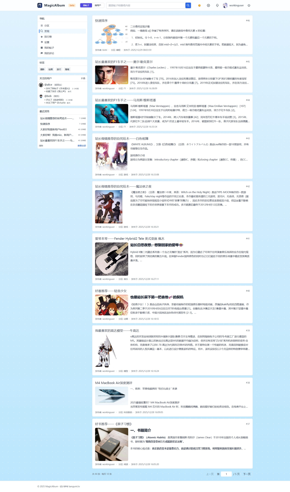
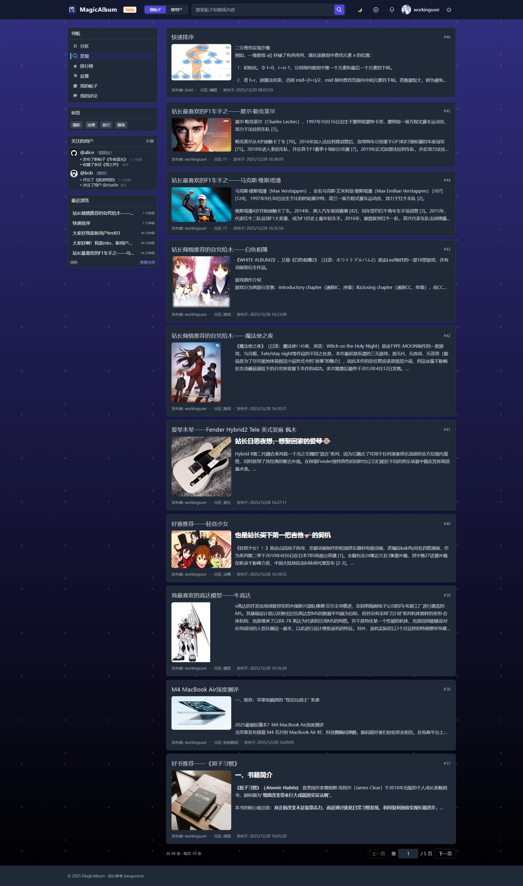

### 内容浏览与互动

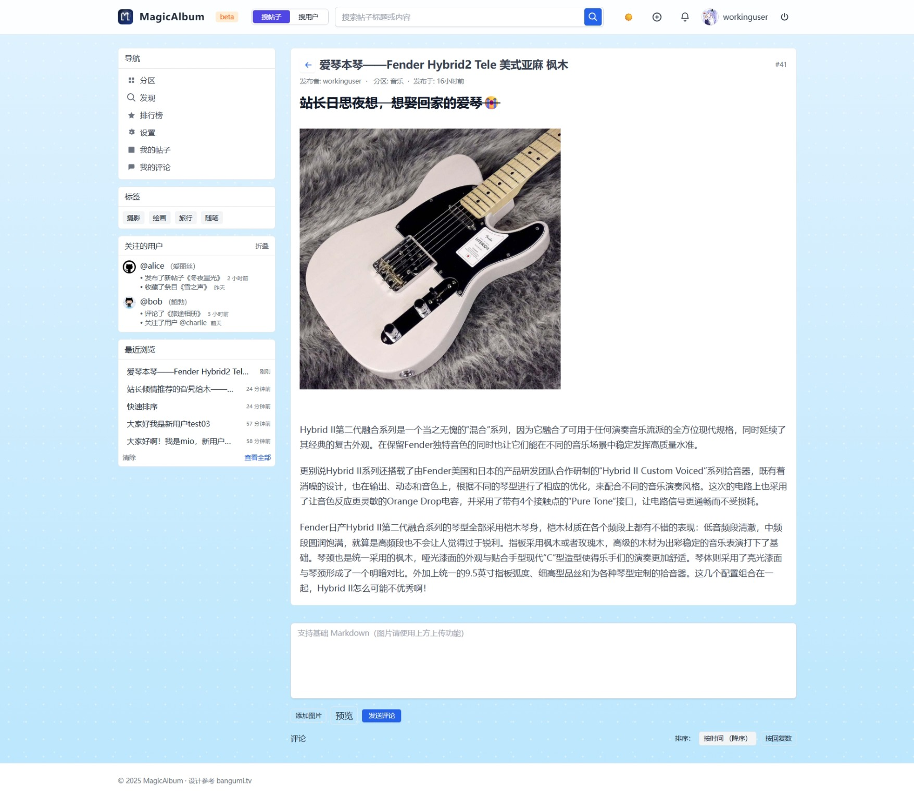
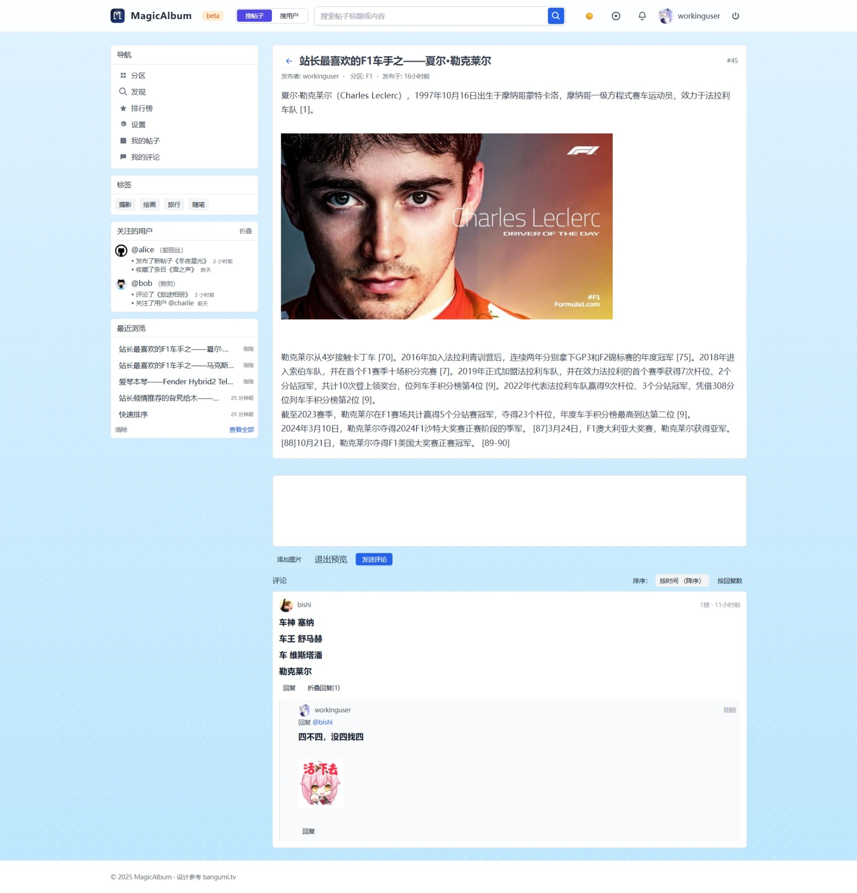
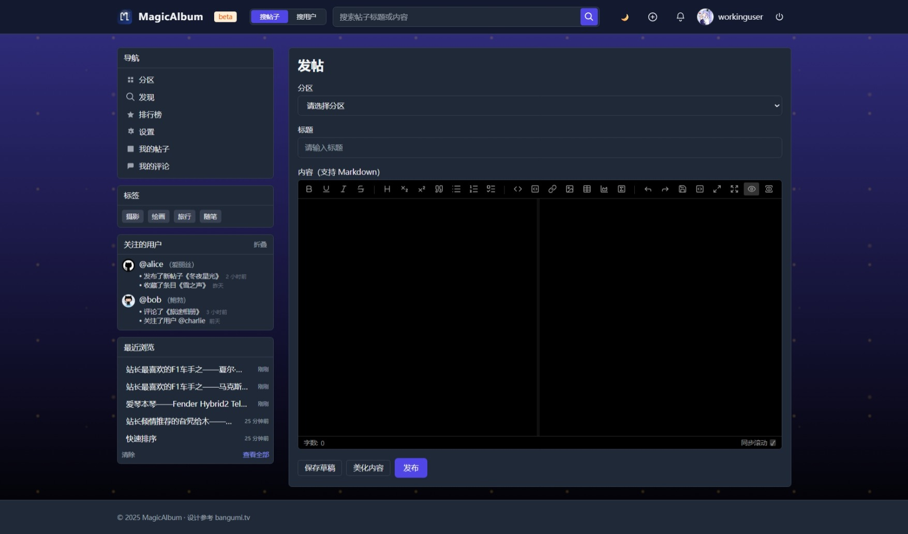

### 用户与个人中心

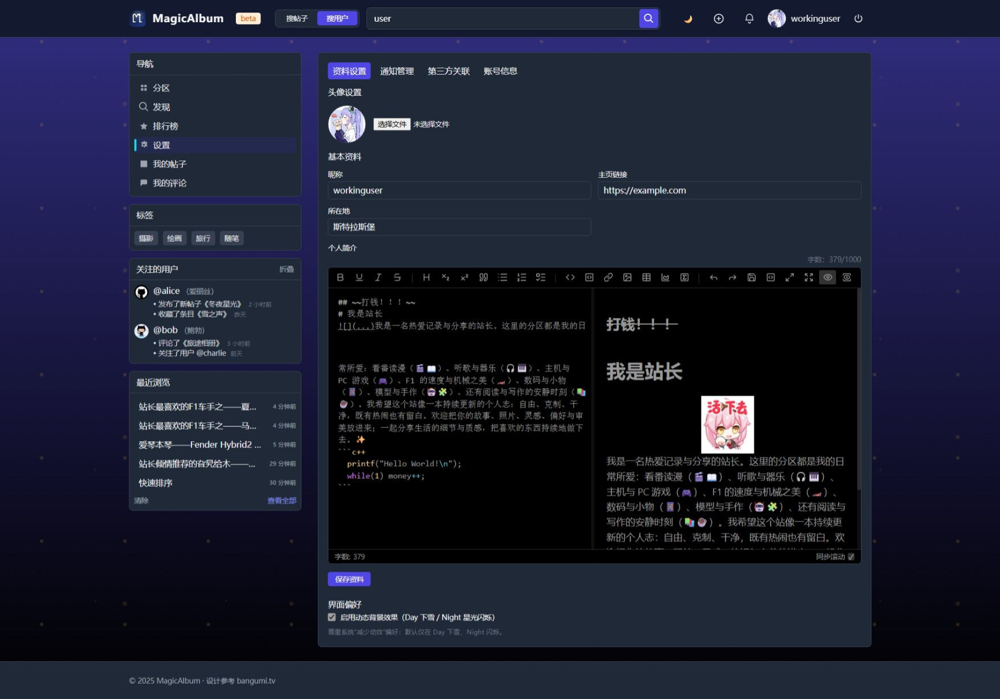
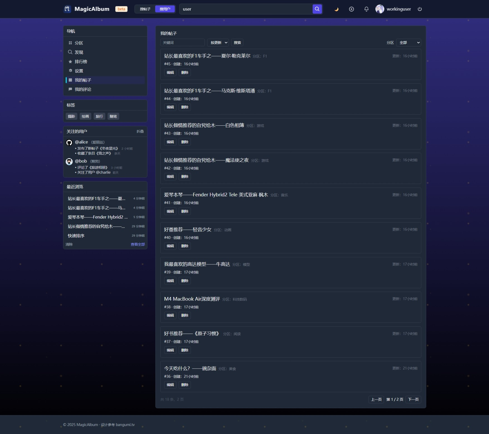
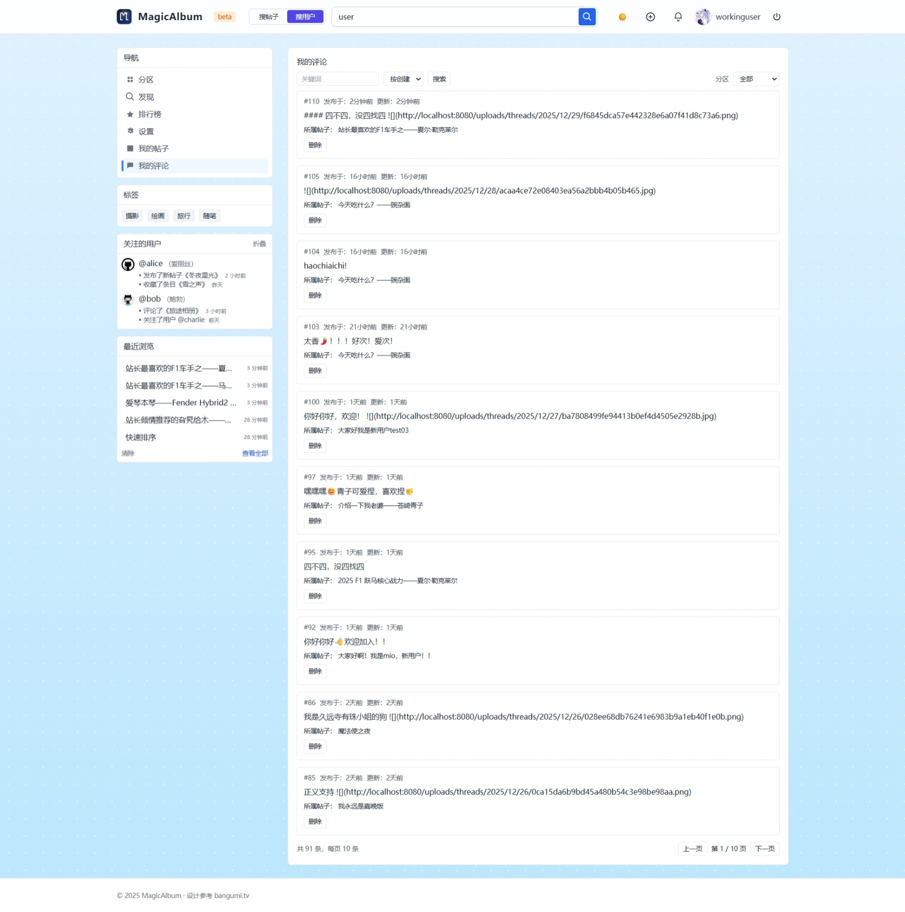

### 搜索与历史记录

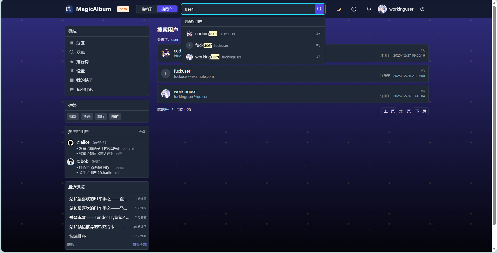
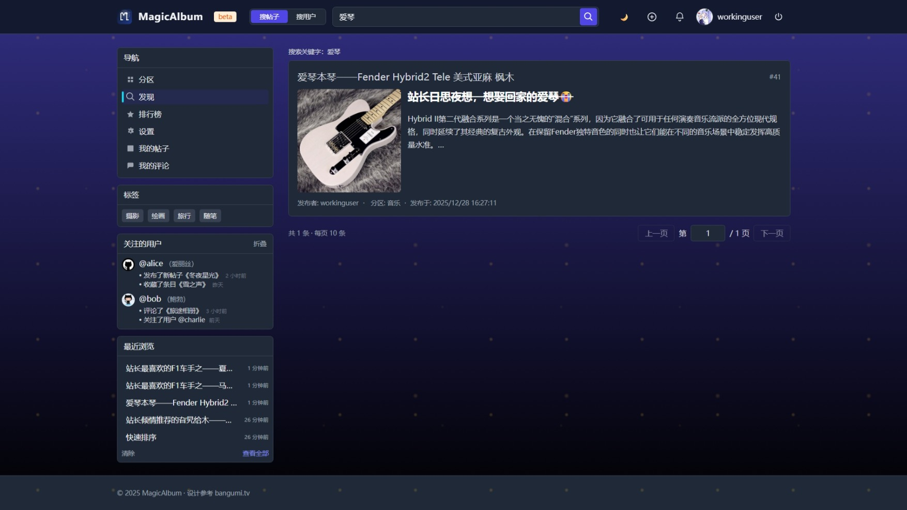
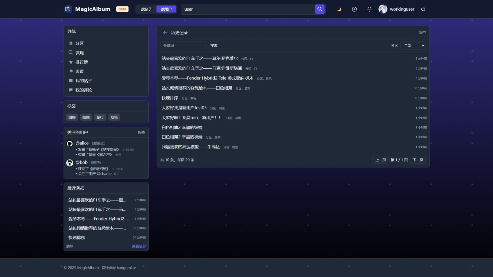

更多截图可见：[docs/示例图片](./docs/示例图片/README.md)

## 技术栈

### 后端

- Java 21
- Spring Boot 4.0.1
- Spring Security
- MyBatis-Plus / JPA
- MySQL 8
- Flyway
- Redis
- RabbitMQ

### 前端

- Vue 3
- Vite 5
- Tailwind CSS 3
- Axios
- Md-editor-v3

### 基础设施

- Docker Compose

## 项目结构

```text
BlueAlbum/
├── end/                   # 后端工程
├── front/                 # 前端工程
├── docs/                  # 文档中心（设计、实施、测试、迁移、故障归档）
├── perf/                  # 性能相关资料
├── docker-compose.yml     # MySQL / Redis / RabbitMQ
└── README.md
```

## 快速开始

### 1. 启动基础设施

```bash
docker compose up -d mysql redis rabbitmq
```

### 2. 启动后端

```bash
cd end
./mvnw clean install -DskipTests
./mvnw spring-boot:run
```

默认数据库配置：

- Host：`localhost`
- Port：`3306`
- DB：`MagicAlbum`
- User：`MagicAlbum`
- Password：`MagicAlbum`

### 3. 启动前端

```bash
cd front
pnpm install
pnpm dev
```

启动后访问：`http://localhost:5173`

### 4. 协作约定

- 前端包管理器统一使用 `pnpm`
- 后端构建与运行统一使用 Maven Wrapper：`./mvnw`
- 根目录不是前端 workspace 入口，前端命令请在 `front/` 下执行

## 二次开发指南

如果你要把它改造成自己的论坛产品，建议优先做这几类替换。

### 1. 品牌替换

- 项目名
- Logo
- 站点标题
- 首页文案
- 主题色和视觉风格

### 2. 业务模型调整

- 分区结构
- 用户字段
- 帖子字段
- 评论规则
- 审核规则

### 3. 基础设施替换

- 文件上传从本地改为 S3 / OSS / COS
- 登录方式扩展为 OAuth / 邮箱验证码 / 手机验证码
- 缓存、消息队列和部署方式按项目需要裁剪

### 4. 模板化增强

- 补一个后台管理端
- 抽统一配置中心
- 抽初始化数据脚本
- 抽品牌配置和站点配置
- 抽互动模块和通知模块

## 推荐模板分层

### 基础版

适合快速落地一个能用的论坛：

- 注册 / 登录
- 用户资料
- 分区 / 帖子 / 评论
- 文件上传
- 基础安全能力

### 增强版

适合沉淀成真正的社区解决方案：

- 管理后台
- 内容审核
- 通知中心
- 点赞 / 收藏 / 关注
- 第三方登录
- AI 摘要 / AI 助手
- 运营位 / 推荐位 / 热榜

### 高级版

适合继续往“通用模板平台”演进：

- 多站点支持
- 多租户
- 插件化扩展机制
- 主题 / 品牌快速切换
- 标准初始化数据和演示站配置

## 文档导航

- 总索引：[docs/README.md](./docs/README.md)
- API 文档：[docs/API/README.md](./docs/API/README.md)
- 需求与设计：[docs/需求与设计/README.md](./docs/需求与设计/README.md)
- 实施与配置：[docs/实施与配置/README.md](./docs/实施与配置/README.md)
- 测试与质量：[docs/测试与质量/README.md](./docs/测试与质量/README.md)
- 技术迁移：[docs/技术迁移/README.md](./docs/技术迁移/README.md)
- 技术扩展：[docs/技术扩展/README.md](./docs/技术扩展/README.md)

## 为什么适合继续模板化

相对从零起一个社区项目，这个仓库已经具备几个关键条件：

- 基础能力闭环已经形成
- 前后端边界相对清晰
- 文档沉淀足够支撑持续演进
- 扩展点已经存在，不需要完全推倒重来

这意味着它很适合继续朝“论坛模板”而不是“单项目代码仓库”去建设。

## Roadmap

### 近期

- [ ] 抽离模板配置层
- [ ] 统一品牌替换项
- [ ] 补齐默认初始化数据
- [ ] 整理一套演示账号和演示内容

### 中期

- [ ] 补后台管理能力
- [ ] 完善点赞 / 收藏 / 通知等互动模块
- [ ] 标准化内容审核流程
- [ ] 补部署文档和生产化建议

### 长期

- [ ] 插件化扩展机制
- [ ] 多站点 / 多租户能力
- [ ] 模板市场化能力
- [ ] 更完整的社区产品解决方案沉淀

## 开源建议

如果你准备把它作为开源模板持续维护，建议仓库后续再补这几项：

- 演示站地址
- 默认演示账号
- Issue 模板和 PR 模板
- 版本变更日志
- 一页式部署文档

## License

本项目采用 [MIT License](https://opensource.org/licenses/MIT)。

---

文档更新日期：2026-04-17
