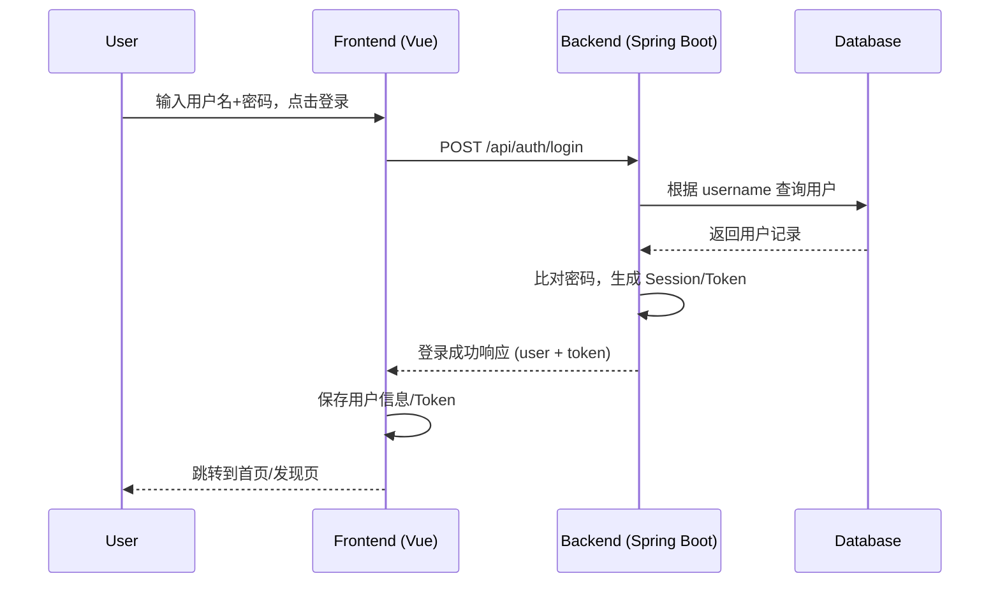
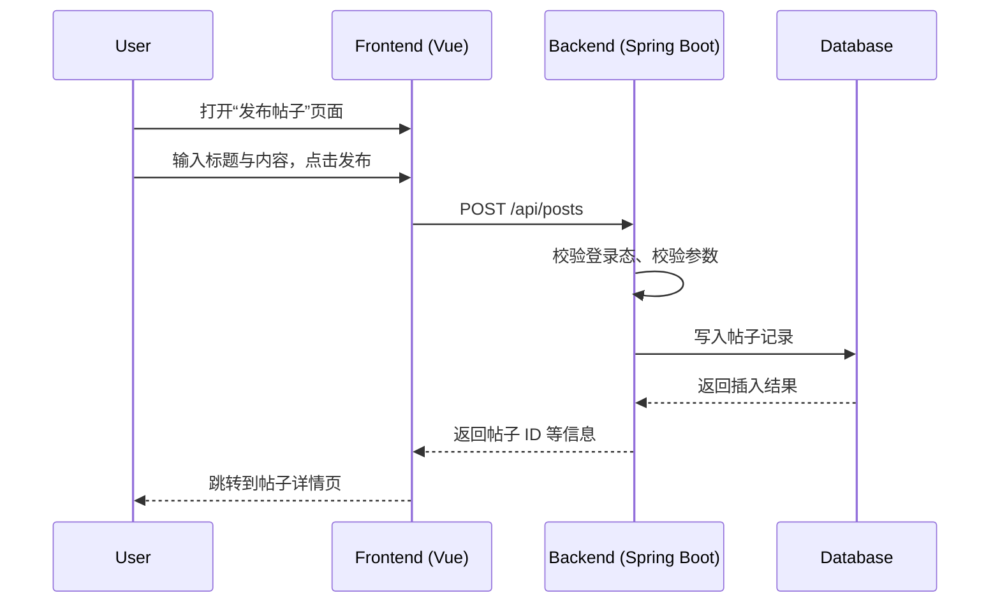
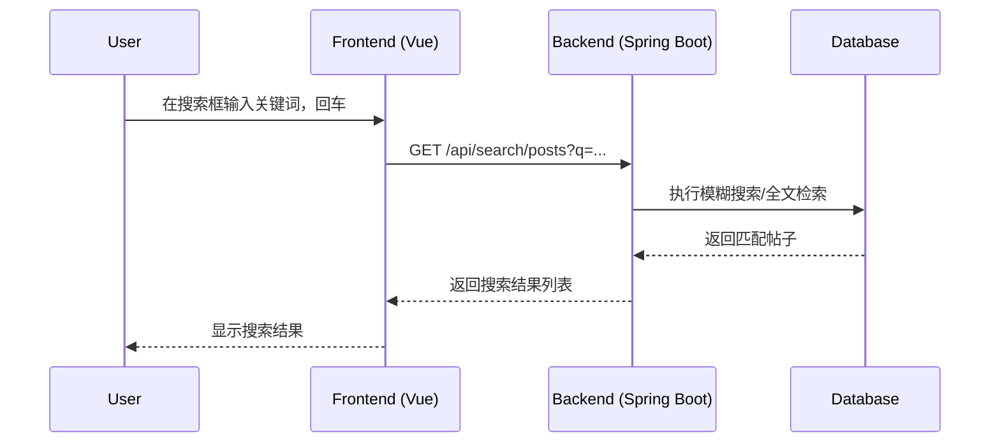

# BlueAlbum 核心功能开发文档（参考稿）

> 本文档为团队内部开发参考，重点说明当前版本中：登录注册、帖子发布、帖子显示、全站查询和查询用户五大核心功能的实现思路与接口用法。可在此基础上进一步整理为正式规范与对外文档。

---

## 1. 环境与基础信息

- **后端技术栈**：Spring Boot + Spring Security（或自定义登录校验）+ MyBatis/JPA（以实际项目为准）
- **前端技术栈**：Vue 3 + Vite + Tailwind CSS
- **接口风格**：RESTful JSON
- **认证方式**：基于登录态（Session/Cookie）或 Token（如 JWT），以实际实现为准
- **文件存储**：本地文件系统 / S3 兼容存储（`S3StorageService`）

> 以下接口路径、字段命名以当前项目约定为主，如与实际代码略有出入，应以后端 `controller` 与 `dto` 的定义为准。

---

## 2. 数据结构概览

### 2.1 User（用户）

典型字段：

- `id: Long` 用户唯一 ID
- `username: String` 登录名（唯一）
- `password: String` 密码（加密存储）
- `nickname: String` 显示昵称
- `avatarUrl: String` 头像链接
- `createdAt: Date` 注册时间

### 2.2 Post（帖子）

- `id: Long` 帖子 ID
- `authorId: Long` 作者用户 ID
- `title: String` 标题
- `content: String` 正文内容（Markdown 原文）
- `contentHtml: String` 预渲染 HTML（可选）
- `createdAt: Date` 创建时间
- `updatedAt: Date` 更新时间
- `tags: List<String>` 标签列表（可选）

### 2.3 通用响应结构

所有接口约定返回统一响应结构（示例）：

```json
{
  "code": 0,
  "message": "ok",
  "data": { }
}
```

- `code`：0 为成功，非 0 为错误码
- `message`：错误说明或提示信息
- `data`：具体业务数据

---

## 3. 登录与注册

### 3.1 注册接口

- **Method**：`POST`
- **Path**：`/api/auth/register`

#### 请求体示例

```json
{
  "username": "alice",
  "password": "123456",
  "confirmPassword": "123456",
  "nickname": "Alice",
  "avatarUrl": "https://example.com/avatar.png"
}
```

#### 响应示例

```json
{
  "code": 0,
  "message": "ok",
  "data": {
    "id": 1,
    "username": "alice",
    "nickname": "Alice",
    "avatarUrl": "https://example.com/avatar.png",
    "createdAt": "2024-01-01T00:00:00Z"
  }
}
```

#### 后端实现要点

- 校验用户名是否已存在；
- 校验密码与确认密码是否一致，密码长度与复杂度；
- 使用 `BCryptPasswordEncoder` 或类似算法加密密码；
- 持久化用户信息到数据库；
- 成功后可选择自动登录（直接创建 Session / 生成 Token）。

#### 前端调用示意（伪代码）

```ts
// src/api/auth.js
export function register(payload) {
  return http.post('/api/auth/register', payload)
}

// 在注册页组件中
const form = reactive({ username: '', password: '', confirmPassword: '', nickname: '' })

async function onSubmit() {
  const res = await register(form)
  if (res.code === 0) {
    // 注册成功，跳转到登录页或直接进入首页
  } else {
    // 显示 res.message
  }
}
```

### 3.2 登录接口

- **Method**：`POST`
- **Path**：`/api/auth/login`

#### 请求体示例

```json
{
  "username": "alice",
  "password": "123456"
}
```

#### 响应示例

基于 Session 的情况下：

```json
{
  "code": 0,
  "message": "ok",
  "data": {
    "id": 1,
    "username": "alice",
    "nickname": "Alice"
  }
}
```

基于 Token（如 JWT）的情况下：

```json
{
  "code": 0,
  "message": "ok",
  "data": {
    "user": {
      "id": 1,
      "username": "alice",
      "nickname": "Alice"
    },
    "token": "<jwt-token>"
  }
}
```

#### 后端实现要点

- 根据用户名查询用户记录；
- 使用密码加密算法比对密码；
- 登录失败时返回统一错误码与信息（避免暴露具体原因，如“用户名不存在/密码错误”细节）；
- 登录成功：
  - Session 方式：在后端创建会话，并通过 Cookie 维持登录态；
  - JWT 等方式：签发 Token，前端保存（`localStorage`/`sessionStorage` 或 Cookie）。

#### 前端调用示意

```ts
// src/api/auth.js
export function login(payload) {
  return http.post('/api/auth/login', payload)
}

// 登录页组件
const form = reactive({ username: '', password: '' })

async function onLogin() {
  const res = await login(form)
  if (res.code === 0) {
    // 保存用户信息
    userStore.setUser(res.data.user || res.data)
    // 如果有 token，则保存 token
    if (res.data.token) tokenStore.setToken(res.data.token)
    // 跳转到首页/发现页
  } else {
    // 弹出错误提示
  }
}
```

### 3.3 登录态校验与拦截

- 前端路由层面：对需要登录的页面使用路由守卫，未登录则跳转到登录页；
- 后端接口层面：在控制器或过滤器中校验当前请求是否已认证，未认证时返回如 `401` 或统一错误码（如 `code = 40100`）。

```ts
// 示例：前端路由守卫
router.beforeEach((to, from, next) => {
  const isAuthed = !!userStore.currentUser
  if (to.meta.requiresAuth && !isAuthed) {
    next({ name: 'login', query: { redirect: to.fullPath } })
  } else {
    next()
  }
})
```

---

## 4. 帖子发布

### 4.1 发布接口

- **Method**：`POST`
- **Path**：`/api/posts`
- **鉴权**：需要登录

#### 请求体示例

```json
{
  "title": "蓝色相册开发记录",
  "content": "# 今日进度\n\n\n\n更多内容...",
  "tags": ["开发日志", "里程碑1"]
}
```

#### 响应示例

```json
{
  "code": 0,
  "message": "ok",
  "data": {
    "id": 1001,
    "title": "蓝色相册开发记录",
    "authorId": 1,
    "createdAt": "2024-01-01T00:00:00Z"
  }
}
```

### 4.2 后端实现要点

- 从登录态中获取当前用户 ID；
- 校验标题与内容非空，长度限制；
- 内容以 Markdown 原文存储，便于后续渲染与处理；
- 可选地在后端提前生成 `contentHtml`（通过 Markdown 渲染器），用于详情页直接展示；
- 可选地抽取首图 URL 便于列表页快速展示缩略图。

### 4.3 前端发布流程

- 使用文本域或 Markdown 编辑器组件输入标题与内容；
- 点击“发布”按钮时调用 `/api/posts` 接口；
- 发布成功后可跳转到帖子详情页或发现列表页。

```ts
// src/api/post.js
export function createPost(payload) {
  return http.post('/api/posts', payload)
}

// 发布页组件
const form = reactive({ title: '', content: '', tags: [] })

async function onPublish() {
  const res = await createPost(form)
  if (res.code === 0) {
    router.push({ name: 'post-detail', params: { id: res.data.id } })
  }
}
```

---

## 5. 帖子显示

### 5.1 列表页（发现页）

- **Method**：`GET`
- **Path**：`/api/posts`

#### 查询参数示例

```text
GET /api/posts?page=1&pageSize=10&keyword=蓝色
```

- `page`：页码，从 1 开始
- `pageSize`：每页数量
- `keyword`：可选，标题/内容关键字

#### 响应示例

```json
{
  "code": 0,
  "message": "ok",
  "data": {
    "total": 123,
    "list": [
      {
        "id": 1001,
        "title": "蓝色相册开发记录",
        "author": {
          "id": 1,
          "nickname": "Alice"
        },
        "content": "# 今日进度...",   // Markdown 原文（可选返回）
        "createdAt": "2024-01-01T00:00:00Z"
      }
    ]
  }
}
```

### 5.2 详情页

- **Method**：`GET`
- **Path**：`/api/posts/{id}`

#### 响应示例

```json
{
  "code": 0,
  "message": "ok",
  "data": {
    "id": 1001,
    "title": "蓝色相册开发记录",
    "author": {
      "id": 1,
      "nickname": "Alice",
      "avatarUrl": "https://example.com/avatar.png"
    },
    "content": "# 今日进度...",       
    "contentHtml": "<h1>今日进度</h1>...", 
    "createdAt": "2024-01-01T00:00:00Z",
    "updatedAt": "2024-01-02T12:00:00Z",
    "tags": ["开发日志"]
  }
}
```

### 5.3 前端展示要点

- 列表页：
  - 从 Markdown/HTML 中抽取首张图片，作为左侧缩略图；
  - 对文本做摘要处理（移除图片、链接和 HTML 标签），只保留可读文本；
  - 图片与文本左右布局，PC 上图片以 `aspect-video`（16:9）比例显示，并在移动端隐藏图片节省空间；
  - 支持“展开/收起图片”交互，展开后显示图片原始尺寸。
- 详情页：
  - 使用 Markdown 渲染器将 `content` 或 `contentHtml` 渲染为安全的 HTML；
  - 对潜在的 XSS 风险做安全过滤（允许必要标签，过滤脚本）。

---

## 6. 全站查询

### 6.1 搜索帖子接口

- **Method**：`GET`
- **Path**：`/api/search/posts`

#### 请求示例

```text
GET /api/search/posts?q=蓝色相册&page=1&pageSize=10
```

#### 响应示例

```json
{
  "code": 0,
  "message": "ok",
  "data": {
    "total": 3,
    "list": [
      {
        "id": 1001,
        "title": "蓝色相册开发记录",
        "snippet": "... 全站查询接口和 Discover 列表 ...",
        "createdAt": "2024-01-01T00:00:00Z"
      }
    ]
  }
}
```

### 6.2 后端实现要点

- 支持在标题和内容字段上做 `LIKE` 搜索，或使用全文索引（如 MySQL FULLTEXT、ES）；
- 对查询参数 `q` 做长度限制、防止 SQL 注入；
- 返回简短摘要 `snippet`，便于前端展示搜索结果上下文。

### 6.3 前端集成

- 顶部导航栏提供搜索输入框；
- 用户敲回车或点击搜索按钮时，跳转到 `/search` 页面并携带 `q` 参数；
- 搜索页通过 `/api/search/posts` 获取结果并展示列表。

```ts
// src/api/search.js
export function searchPosts(params) {
  return http.get('/api/search/posts', { params })
}
```

---

## 7. 查询用户

### 7.1 按用户名 / 昵称查询

- **Method**：`GET`
- **Path**：`/api/users`

#### 请求示例

```text
GET /api/users?keyword=alice&page=1&pageSize=10
```

#### 响应示例

```json
{
  "code": 0,
  "message": "ok",
  "data": {
    "total": 1,
    "list": [
      {
        "id": 1,
        "username": "alice",
        "nickname": "Alice",
        "avatarUrl": "https://example.com/avatar.png",
        "createdAt": "2024-01-01T00:00:00Z"
      }
    ]
  }
}
```

### 7.2 查询单个用户详情

- **Method**：`GET`
- **Path**：`/api/users/{id}`

#### 响应示例

```json
{
  "code": 0,
  "message": "ok",
  "data": {
    "id": 1,
    "username": "alice",
    "nickname": "Alice",
    "avatarUrl": "https://example.com/avatar.png",
    "createdAt": "2024-01-01T00:00:00Z"
  }
}
```

### 7.3 前端使用场景

- 用户列表页 / 管理后台；
- 帖子详情页中点击作者昵称，跳转到用户主页；
- 搜索结果中区分用户与帖子结果。

---

## 8. 接口示意图与时序图

以下示意图使用 Mermaid 语法，可在支持 Mermaid 的 Wiki/文档平台中直接渲染。

### 8.1 登录流程时序图



### 8.2 发布帖子流程图



### 8.3 全站搜索流程图



---

## 9. 错误处理与安全

### 9.1 错误码约定建议

可在现有基础上进一步规范错误码，例如：

- `0`：成功
- `400xx`：参数错误
- `401xx`：认证/鉴权问题（未登录、Token 过期等）
- `404xx`：资源不存在
- `500xx`：服务端内部错误

### 9.2 安全要点

- 密码必须加密存储，不得明文；
- 登录接口需做频率限制，防止暴力破解；
- Markdown 渲染需做 XSS 过滤，禁止 `<script>` 等危险标签；
- 上传图片时，后端需校验文件类型与大小；
- 查询接口（尤其是全站搜索）应做好防注入、防止过大分页参数。

---

## 10. 前端页面与后端接口映射（示例）

- `front/src/pages/Login.vue`
  - 调用：`POST /api/auth/login`
- `front/src/pages/Register.vue`
  - 调用：`POST /api/auth/register`
- `front/src/pages/Discover.vue`
  - 调用：`GET /api/posts`（列表）
  - 调用：`GET /api/search/posts`（搜索）
- `front/src/pages/PostCreate.vue`
  - 调用：`POST /api/posts`（发布）
- `front/src/pages/PostDetail.vue`
  - 调用：`GET /api/posts/{id}`（详情）

> 具体文件名与路径可根据实际项目略有差异，以上对应关系主要用于新成员快速理解“哪个页面调了哪个接口”。

---

## 11. 后续扩展建议

- 为接口补充更加正式的 API 规范（可在 `docs/API规范.md` 中引用本文件）；
- 为登录/注册、发帖、搜索等关键流程补充自动化测试用例；
- 对图片上传和展示（`S3StorageService` 及相关前端组件）单独撰写一份存储与展示方案文档；
- 在 CI/CD 中引入简单的接口连通性检查（smoke test）。

---

> 本文档为参考稿，可根据实际实现情况进行增删和细化，并在里程碑交付时同步更新。

---

## 12. 评论区增强与 Markdown 支持（新增）

为提升帖子详情页的互动体验与内容可读性，当前版本新增并完善了评论区的楼中楼显示与 Markdown 预览/渲染能力。以下为实现要点与使用说明。

### 12.1 楼中楼评论显示优化

- 顶层评论容器化显示：每个顶层评论作为一个卡片容器，其所有子回复都在同一容器内按层级展示，而不是各自独立成块。
- 子回复统一缩进：同一容器内的所有子回复采用统一缩进（例如 `24px`），在视觉上更整齐一致。
- 层次感增强：子回复区域左侧增加细竖线并配合淡色背景，白天/夜间模式下颜色自动适配，提升层级结构辨识度。
- 楼层号标注：顶层评论显示“X楼”，子回复显示“X-Y”“X-Y-Z”等层级编号，例如“1楼”“1-1”“1-1-1”，便于快速定位与沟通。
- 回复提示与锚点跳转：子回复支持显示“回复 @父评论作者”，并可通过锚点跳转快速定位到被回复的评论。
- 折叠/展开子回复：为顶层评论提供“折叠/展开回复(n)”按钮，长楼层可折叠，避免影响整体阅读。

实现要点（前端）：

- 在构建评论树时将子评论附加父评论作者信息，用于展示“回复 @用户名”。
- 将评论渲染从扁平列表重构为分组结构（`group = { root, items[] }`），在模板中以“顶层容器 + 子回复列表”方式渲染。
- 为子回复区域增加主题感知的样式变量（浅色/深色），统一缩进与左侧竖线的风格。

### 12.2 Markdown 输入与预览

- 评论输入支持 Markdown 预览：在输入区提供“编辑/预览”模式切换按钮，用户可即时查看 Markdown 效果。
- 安全渲染：使用 `markdown-it` 渲染 Markdown 并通过 `DOMPurify` 做 XSS 安全过滤，禁止危险标签与脚本。
- 样式完善：启用 Tailwind Typography 插件，使用 `prose` 容器，让标题（H1/H2/H3）、列表、引用、代码块等 Markdown 元素获得良好默认样式。

实现要点（前端/样式）：

- 安装 `@tailwindcss/typography` 并在 `tailwind.config.cjs` 的 `plugins` 中启用：`require('@tailwindcss/typography')`。
- 在评论预览区包裹 `prose` 类容器，使 H1/H2/H3 等标题样式正常生效；夜间模式可使用 `prose-invert` 适配暗色主题。

### 12.3 相关文件与变更

- `front/src/components/Comments.vue`
  - 楼中楼显示、统一缩进、细竖线与淡色背景、楼层号计算与展示、折叠/展开子回复按钮、回复 @用户名与锚点跳转、Markdown 预览切换。
- `front/tailwind.config.cjs`
  - `plugins` 中新增 `require('@tailwindcss/typography')`，使 `prose` 样式对 Markdown 标题等元素生效。
- 受影响页面
  - `front/src/pages/PostDetail.vue`（或详情页组件）：引入并使用 `Comments.vue`，帖子详情页的评论区显示上述增强效果。

### 12.4 验证与测试建议

- 评论结构验证：在帖子详情页添加多层回复，检查顶层容器包裹、统一缩进、左侧竖线与淡色背景、楼层号标注是否正确。
- 交互验证：测试“回复 @用户名”的显示与锚点跳转，验证折叠/展开按钮在长楼层下的可用性与可读性。
- 主题验证：切换白天/夜间模式，检查子回复竖线与背景的颜色适配是否清晰、不过暗或过亮。
- Markdown 验证：在评论预览中输入 H1/H2/H3 标题、列表、引用、代码块等，确认在 `prose` 容器下样式正确；确保 `DOMPurify` 安全过滤有效。

### 12.5 后续扩展建议

- 楼层号点击复制或分享：支持一键复制评论锚点链接，便于外部分享精准定位。
- 复杂折叠策略：为超长子链提供按层级折叠或“只显示最近 n 条”选项。
- Markdown 扩展：可按需启用目录（TOC）、任务列表、表格、代码高亮等高级特性，并保持安全过滤。

### 12.6 功能总览与交互流程（评论模块）

- 功能概览：
  - 支持对帖子进行评论与楼中楼回复（任意评论可被回复）。
  - 顶层评论作为容器，子回复在同容器内展示，统一缩进与层次样式。
  - 自动折叠长楼层（基于数量与宽度阈值），用户可手动展开/折叠。
  - 显示“回复 @父评论作者”与锚点跳转，快速定位被回复评论。
  - 评论输入支持 Markdown 预览、图片上传（自动插入 Markdown 图片）。
  - 样式在浅色/深色主题下自适配，提升可读性与一致性。

- 交互流程（典型）：
  1) 用户登录后，在详情页底部评论区输入内容（可在“编辑/预览”间切换）。
  2) 点击“发送评论”，前端进行基础校验与乐观更新；后端创建评论成功后更新列表。
  3) 点击某条评论的“回复”按钮，设置 `replyToPostId`，再次发送则成为该评论的子回复。
  4) 对长楼层可通过“折叠/展开回复(n)”控制显示范围；点击“@用户名”锚点可定位到父评论。

### 12.7 组件属性（Props）与配置

- 组件：`front/src/components/Comments.vue`
- 必需属性：
  - `threadId: number` 帖子（主题）ID，用于加载与提交评论。
- 可选属性（自动折叠策略）：
  - `autoCollapseCountThreshold: number` 默认 `5`。同楼层子回复条数大于该值时默认折叠。
  - `autoCollapseWidthThreshold: number` 默认 `720`（px）。当楼层容器宽度大于该值时默认折叠。
- 使用示例：
  - `<Comments :threadId="id" :autoCollapseCountThreshold="5" :autoCollapseWidthThreshold="720" />`

### 12.8 楼层号生成规则

- 顶层评论：以“序号 + 楼”显示（例如 `1楼`、`2楼`）。
- 子回复：在顶层序号基础上按子序递增，以“-”连接（例如 `1-1`、`1-2-1`）。
- 排序：默认按 `createdAt` 时间升序，同层内保证稳定序列以确保楼层号可预期。

### 12.9 自动折叠策略（细节）

- 触发条件：满足以下任一条件将默认折叠（不覆盖用户手动切换）：
  - 子回复数量 `> autoCollapseCountThreshold`。
  - 楼层容器宽度 `> autoCollapseWidthThreshold`。
- 监听机制：
  - 在初次渲染、分组更新及容器尺寸变化时重新计算；用户点击“展开/折叠”后不再被后续自动判定覆盖。
- 设计意图：当楼层过长或容器过宽时默认折叠，避免影响主体内容阅读；同时保留用户自主控制。

### 12.10 Markdown 与图片支持

- Markdown 渲染：`markdown-it`（启用 `breaks`、`linkify`、`html`），配合 `DOMPurify` 进行 XSS 安全过滤。
- 代码高亮：`highlight.js` 自动或按声明语言高亮代码块。
- 数学公式：`markdown-it-katex` 支持 LaTeX 数学表达式渲染。
- 图片处理：
  - 上传：通过图片上传接口（`uploadImage`）返回 URL，自动插入 `` 到输入框。
  - 规范化：对非 http(s) 链接进行后端基址拼接与路径规范化，确保资源可正确显示。

### 12.11 接入与示例（前端）

- 在帖子详情页组件中引入并使用 `Comments.vue`：
  - 加载时根据 `threadId` 请求评论列表（分页参数可在 `listPosts` 中配置）。
  - 用户登录后可发布评论与回复（`createPost(threadId, { contentMd, replyToPostId })`）。
  - 图片上传按钮文案为“添加图片”，发送动作按钮文案为“发送评论”。

### 12.12 常见问题与注意事项

- 登录态：评论与回复需登录，前端在未登录状态下显示提示并阻止发送。
- 内容长度：前端对评论长度进行基础限制（例如 `<= 3000` 字符），避免异常数据。
- 锚点跳转：当被回复的父评论不在当前可视区域时，锚点可将页面定位到父评论位置。
- 主题适配：浅色/深色模式下的左侧竖线与背景色已做适配，若需品牌化可进一步在 Tailwind 配置中自定义色板。
- 安全性：Markdown 渲染后统一经过 `DOMPurify` 清洗，禁止脚本与危险标签；后台仍应进行服务端层面的输入校验与过滤。
 
### 12.13 分页页数计算修正（页数基于顶层楼层）

为避免页数计算包含楼中楼子回复导致页数偏大，评论模块新增以下计算属性与逻辑修正（前端 `Comments.vue`）：

- `totalGroups`：顶层楼层总数（仅统计顶层评论数量，不含子回复）。
- `pageCount`：总页数。当前端已聚合完整数据时，基于 `totalGroups` 与每页大小 `size` 计算；否则回退到后端返回的 `total`（保持后端分页模式）。
- `hasPagination`：是否显示分页控件。当 `pageCount > 1` 时显示。
- 更新 `watch` 与导航函数（`goPrevPage`、`goNextPage`、`applyPageInput`）中的 `max` 计算，使其在全量聚合模式下基于 `totalGroups` 限制页码范围；后端分页模式保持原逻辑。
- 模板更新：分页区域显示条件从 `total > size` 改为 `hasPagination`，总页数显示改用 `pageCount`，按钮禁用条件统一使用 `page >= pageCount`。

验证方法：构造含有多条子回复的楼层（如 35 顶层评论、若干子回复），确认页数以顶层数量为准（如每页 15，则 `pageCount = 3`），不存在因子回复导致的额外页数。

### 12.14 楼层编号策略调整（稳定的“原始到达顺序”）

为满足“楼层编号应按照先到后来的顺序，不受时间或回复数影响”的需求，调整楼层编号生成策略：

- 楼层号在分组阶段一次性确定，严格依据“原始到达顺序”。
- 任何后续的排序与分页操作不再覆写楼层号（移除分页阶段对楼层号的覆盖逻辑）。
- 子回复编号保持层级形式（如 `1-1`、`1-2-1`），但顶层“X楼”始终稳定。

验证方法：在不同排序模式（按时间、按热度）与跨页浏览下，检查同一条顶层评论的楼层号不变。

### 12.15 全局评论输入框位置与宽度调整

- 位置：将全局评论输入框移动到“评论”标题行的上方（非标题下方），以便用户更快开始评论；楼中楼内联回复输入框位置不变。
- 显示条件：仅当未在回复楼中楼（无 `replyToPostId`）时显示全局输入框，避免混淆。
- 宽度：将输入框与预览容器宽度从固定 `w-[720px]` 改为 `w-full`，自适应内容区与评论区宽度。
- 交互：保留编辑/预览切换、图片上传与发送评论功能不变。

验证方法：在详情页检查输入框位于“评论”标题上方，宽度与内容区一致；切换编辑/预览与上传图片流程正常。

---

## 13. 顶栏 Logo 更新（ACG 风格 Magicalbum）

为增强品牌识别度与 ACG 氛围，前端顶栏新增并集成 `IconMagicalbum.vue`：

- 位置与替换：在 `HeaderBangumi.vue` 左侧用 `<IconMagicalbum />` 替换原 `favicon` 图片。
- 风格与元素：深蓝渐变夜空、柔和白色漫射高光、简洁的 “M” 线性符号、右上折角相册页意象、星辉点缀与纤细月牙。
- 主题适配：在浅色与深色主题下均保持清晰对比与简洁克制的视觉表现。
- 体积与可访问性：SVG 矢量、`aria-label` 声明，尺寸与对齐与标题一致（`w-7 h-7`）。

可选后续：导出统一的 `favicon.svg/.ico` 替换浏览器标签页图标；为品牌字标“MagicAlbum”设计一版字距优化的字标以搭配 Logo。
### 13. 用户设置与“我的内容”（新增）

本章节描述“资料设置、通知管理、第三方关联（预留）”以及“我发布的帖子与评论”的实现计划与数据模型对齐。

#### 13.1 页面与路由
- 入口：`/settings`（登录态）。
- 标签：资料（Profile）、通知（Notifications）、第三方关联（Connected）、我的帖子（My Threads）、我的评论（My Posts）。

#### 13.2 前端数据模型与交互
- 资料设置：字段 `nickname, avatarUrl, bio, homepageUrl, location, links[]`；保存为部分更新。
- 设置（Settings）：包含 `display/markdown/comments/notifications/privacy` 五组；更新为部分合并。
- 通知管理：列表分页、按类型与是否未读筛选；支持单条“标记已读”。
- 我的帖子：分页查询、按关键词与分区筛选；支持编辑（Patch 更新 `title/content/sectionId` 并刷新 `updatedAt`）与删除。
- 我的评论：分页查询、可按帖子过滤；支持删除。

#### 13.3 后端接口（与《API规范.md》一致）
- 参考《API规范.md》“用户设置与我的内容（新增）”章节；核心路径：
  - `/users/me`（GET/PATCH 资料）
  - `/users/me/settings`（GET/PATCH 偏好设置）
  - `/notifications`、`/notifications/settings`（GET/PATCH）
  - `/users/me/connected-accounts`（GET/POST/DELETE 预留）
  - `/users/me/threads` 与 `/threads`（支持 authorId/mine 过滤）
  - `/users/me/posts` 与 `/posts`（支持 authorId/mine 过滤）

#### 13.4 服务端数据设计建议
- `users`：基础信息字段与索引（username 唯一）。
- `user_settings`：JSON（display/markdown/comments/notifications/privacy），按字段白名单合并更新。
- `threads`：`id,title,content,sectionId,authorId,createdAt,updatedAt`；`updatedAt` 在 Patch 时自动更新时间戳。
- `posts`：`id,threadId,content,authorId,replyToPostId,createdAt`。
- `connected_accounts`（可选）：`userId, provider, connectedAt, meta`。
- `notifications`：`id,userId,type,title,content,createdAt,read,relatedThreadId,relatedPostId`。

#### 13.5 安全与校验
- 所有 `me` 路径强制鉴权；资源操作校验“本人”。
- 对文本字段进行 XSS 过滤与长度限制；敏感操作可要求近期认证（re-auth）。
- 频率限制：更新设置、删除、编辑等写操作建议加限流与审计日志。

#### 13.6 前端实现计划（里程碑）
- 里程碑A（本次范围）：
  - 资料设置页：展示与编辑、头像上传（沿用 `uploads/images`）。
  - 通知管理页：列表与筛选、标记已读、通知设置表单。
  - 第三方关联页：展示连接状态，调用预留接口（UI提示为“开发中/即将支持”）。
  - 我的帖子页：列表、搜索、编辑（Patch）、删除；显示 `updatedAt`。
  - 我的评论页：列表、搜索（按帖）、删除。
- 里程碑B：隐私设置、会话管理、安全增强（re-auth/2FA 预留）。

#### 13.7 与现有前端的衔接
- `listThreads` 已支持 `q/sectionId`；建议扩展为 `authorId/mine` 参数，或使用 `/users/me/threads` 实现“我的帖子”。
- 评论模块已存在 `listPosts/updatePost/deletePost`；建议新增 `/users/me/posts` 用于“我的评论”。
- 设置与通知：新增前端 API 模块，统一从 `client.js` 共享鉴权。

#### 13.8 验证与测试建议
- 接口联通性：在未登录与登录态下分别验证错误码与返回结构。
- 资料与设置：空值、超长、非法URL等边界；确认部分更新合并策略正确。
- 我的帖子/评论：只返回本人数据；编辑后 `updatedAt` 变化；删除权限校验。
- 通知：筛选与分页正确；标记已读状态持久化。