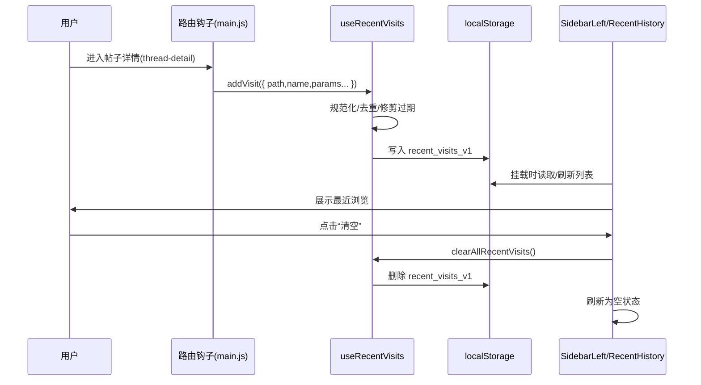

# MagicAlbum 技术架构与实现细节（2025-12-27）

本文档面向工程实现与维护人员，旨在统一项目的技术架构、关键模块设计与实现要点，并记录当前里程碑的落地细节与约束，便于后续扩展与联调。

## 架构概览
- 前端：Vue 3 + Vite + TailwindCSS + vue-router + axios。
- 后端：Spring Boot（REST API），JPA/MyBatis，文件存储（本地或兼容 S3），可选 Redis。
- 通信：HTTP/JSON，统一前缀 `\`/api/v1`，前端携带 `Authorization: Bearer <token>`（非 Mock 模式下）。

## 前端实现细节

### 1. 路由与页面
- 路由名称：
  - `sections` → `/sections`
  - `discover` → `/discover`
  - `users` → `/users`
  - `user-profile` → `/users/:id`
  - `thread-create` → `/threads/new`
  - `thread-detail` → `/threads/:id`
  - `settings` → `/settings`
  - `my-threads` → `/my/threads`
  - `my-posts` → `/my/posts`

### 2. 认证与会话
- 组合式函数 `src/composables/useAuth.js`：
  - `tokenRef` 来源于 `localStorage.accessToken`；Mock 模式下以 `mock-token-*` 作为占位并避免随请求发送。
  - `loginWithPhonePassword` / `loginWithEmailPassword` 成功后写入 `accessToken` 与 `currentUser`；随后触发 `window.location.reload()` 强制刷新全站状态。
  - `logout()` 清空本地存储并触发强制刷新。
- 顶栏 `HeaderBangumi.vue`：
  - 在 `settings`、`my-threads`、`my-posts` 页面点击“登出”时，先 `router.replace({ name: 'discover' })`，再延迟调用 `logout()`，最终刷新停留在“发现”页。

### 3. Axios 客户端
- `src/api/client.js`：
  - `baseURL` 读取 `VITE_API_BASE_URL`（默认 `http://localhost:8080/api/v1`）。
  - 请求拦截器：在非 Mock 令牌下附加 `Authorization: Bearer <token>`。
  - 响应拦截器：`401` 时自动清除令牌，并提示“登录已过期，请重新登录”。

### 4. 评论组件与锚点定位
- 组件：`src/components/Comments.vue`。
- 结构：按“楼层（root）+ 子回复”分组，支持分页与折叠/展开；DOM 元素 id 绑定为 `post-{id}`。
- 本地持久化：
  - 每主题帖的分页与折叠状态分别存储在 `localStorage`，键格式：
    - `comments_pages_map_{threadId}`
    - `comments_collapsed_map_{threadId}`
- 锚点定位：
  - 约定从“我的评论”进入帖子详情的 URL 为 `/threads/{threadId}#post-{postId}`。
  - 详情页解析 `route.hash` 中的评论 ID，传入 `Comments` 组件（属性 `scrollToPostId`）。
  - 组件在挂载或属性变化时：展开包含目标评论的楼层、切换至包含该评论的分页，并调用 `el.scrollIntoView({ behavior: 'smooth', block: 'center' })`。

### 5. 发现与搜索
- “发现”页 `Discover.vue`：
  - 支持按关键字与分区筛选，分页浏览帖子列表。
- 用户搜索 `UsersSearch.vue`：
  - 输入防抖 + 联想建议（`suggestUsers`），并异步拉取个人资料以补全昵称与头像。

### 6. 设置页
- `Settings.vue` 分为“资料设置 / 通知管理 / 第三方关联”：
  - 加载与更新分别调用 `getMyProfile / updateMyProfile / getMySettings / updateMySettings / listConnectedAccounts`。
  - 交互采用轻量状态与分区面板；后续可将通知与偏好设置抽取为独立模块。

## 后端实现细节

### 1. DTO 与返回结构
- `PostDto`：新增可选字段 `threadTitle`，用于前端“我的评论”列表显示所属帖子标题。
  - `PostService.toDto` 中可通过 `threadRepository.findById(threadId)` 补齐标题；无法获取时置空。
- `ThreadDto`：包含 `title`、`section`、`author` 等核心字段。

### 2. 认证
- 若使用 Cookie/Session 模式，前端 `withCredentials = true`；若使用 JWT，统一在响应中返回 `accessToken` 并由前端保存。
- 统一错误码与消息：`401` 未登录、`403` 权限不足、`404` 资源不存在、`429` 频率限制、`500` 服务器错误。

### 3. 文件与图片
- 前端通过 `normalizeImageUrl` 将相对路径转换为后端静态资源路径（`VITE_API_BASE_URL` 去掉 `/api/v1` 后的根作为前缀）。
- 后端建议统一静态文件路径与访问鉴权策略（公开/私有）。

## 开发与部署
- 开发环境：Node >= 18；`npm run dev` 启动前端；后端 `mvnw spring-boot:run` 或 IDE 运行。
- 配置：`.env` 中覆盖 `VITE_API_BASE_URL`；后端通过环境变量配置 DB 与 CORS。
- 部署：Docker Compose（`front` 构建为静态，`end` 作为服务，`db` 为数据库）。

## 约束与后续计划
- 评论锚点定位在移动端的滚动表现与高亮样式需统一；
- `threadTitle` 补齐与一致性在后端联调阶段完善；
- 登录/登出强制刷新在大型页面可考虑改为清空状态并软刷新，以减少全量重载的闪烁。

## 最近浏览历史

本章节概述“最近浏览历史”的架构与实现要点，覆盖数据来源、存储、读取展示、交互流程与可配置项。详细技术说明另见《docs/技术实现-最近浏览历史.md》。

### 架构与边界
- 数据来源：通过路由钩子在 `src/main.js` 初始化 `initRecentVisitsTracking()`，仅记录 `thread-detail` 页面访问。
- 存储介质：`localStorage`，键名 `recent_visits_v1`；与登录状态解耦（登出不清除，除非显式清空）。
- 读取展示：
  - 左侧侧栏 `src/components/SidebarLeft.vue` 在“已登录”时显示最近浏览列表与“清空”入口；
  - 历史页 `src/pages/RecentHistory.vue` 支持搜索与分区筛选、分页浏览、清空全部。
- 组合式模块：`src/composables/useRecentVisits.js` 提供写入、读取、去重、过期清理与标题/分区补齐。

### 数据模型与策略
- 记录结构：`{ path, name, title, id, sectionId, sectionName, ts }`。
- 去重策略：优先按 `id` 去重，其次按 `path`；更新已存在项的时间戳与标题/分区信息。
- 上限与过期：最多保留 10 条（`MAX_ITEMS=10`），有效期 7 天（`MAX_AGE_MS=7*24*60*60*1000`）。

### 关键交互时序

### 历史页搜索与筛选
- 搜索：改为“非实时触发”，输入框本地状态 `searchText`，在按 Enter 或点击搜索按钮时调用 `applySearch()` 更新查询；避免每击键触发筛选。
- 分区筛选：保持实时变更（选择项变化即更新）。

### 登录与可见性
- 存储独立于账号；登出后记录仍在，下一次登录继续展示。
- 侧栏与历史页入口受登录状态控制；未登录不显示最近浏览模块。

### 可配置项与扩展
- 位置：`src/composables/useRecentVisits.js`（`MAX_ITEMS`、`MAX_AGE_MS`、键名）。
- 账号维度：可改为 `recent_visits_${userId}` 区分不同用户的历史；或在 `useAuth.logout()` 中调用清空以绑定登出行为。
- 记录范围：当前仅 `thread-detail`；如需扩展可在路由钩子中增加白名单页面。

### 关联文件
- `src/main.js`：初始化追踪（`initRecentVisitsTracking`）。
- `src/composables/useRecentVisits.js`：核心读写与维护逻辑。
- `src/components/SidebarLeft.vue`：最近浏览侧栏展示与清空入口。
- `src/pages/RecentHistory.vue`：历史记录页的筛选、搜索与分页。