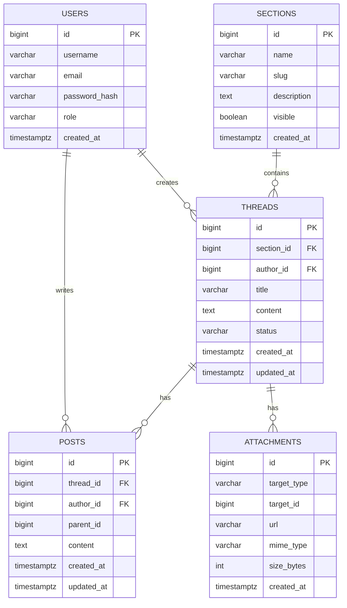

# MagicAlbum 数据库设计（初稿）

版本：v0.1 初稿  
状态：草案  
更新日期：2025-12-21

## 1. ER 模型（概念）

## 2. 逻辑表结构与字段字典

### 2.1 `users`
- `id` bigint PK
- `username` varchar(64) 唯一
- `email` varchar(128) 唯一
- `password_hash` varchar(255)
- `role` varchar(32) 枚举：`user`/`admin`
- `created_at` timestamptz 默认 `now()`
索引：`uk_users_username`、`uk_users_email`

### 2.2 `sections`
- `id` bigint PK
- `name` varchar(128)
- `slug` varchar(128) 唯一、URL 友好
- `description` text
- `visible` boolean 默认 true
- `created_at` timestamptz
索引：`uk_sections_slug`、`idx_sections_name`

### 2.3 `threads`
- `id` bigint PK
- `section_id` bigint FK -> `sections.id`
- `author_id` bigint FK -> `users.id`
- `title` varchar(256)
- `content` text
- `status` varchar(32) 枚举：`published`/`hidden`
- `created_at` timestamptz，`updated_at` timestamptz
索引：`idx_threads_section_created`(`section_id`,`created_at desc`)

### 2.4 `posts`
- `id` bigint PK
- `thread_id` bigint FK -> `threads.id`
- `author_id` bigint FK -> `users.id`
- `parent_id` bigint 可空，用于楼中楼
- `content` text
- `created_at` timestamptz，`updated_at` timestamptz
索引：`idx_posts_thread_created`(`thread_id`,`created_at`)

### 2.5 `attachments`（可选）
- `id` bigint PK
- `target_type` varchar(16) 枚举：`thread`/`post`
- `target_id` bigint
- `url` varchar(512)
- `mime_type` varchar(128)
- `size_bytes` int
- `created_at` timestamptz
索引：`idx_attachments_target`(`target_type`,`target_id`)

## 3. 约束与规范
- 所有外键使用 `ON DELETE RESTRICT` 或 `CASCADE` 依业务而定。
- 所有时间戳统一为 UTC，入库前完成时区转换。
- 文本字段最大长度与索引策略需结合具体 DB 选择调整。

---