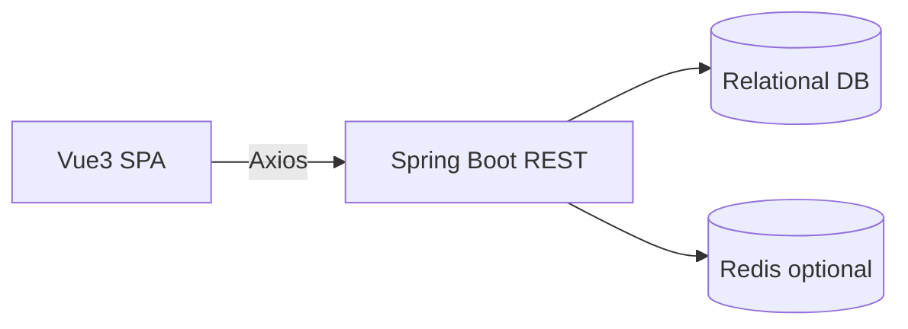

# MagicAlbum 概要设计（初稿）

版本：v0.1 初稿  
状态：草案  
更新日期：2025-12-21

## 1. 架构总览
- 分层：前端（SPA）+ 后端（REST API）+ 数据库 + 可选缓存。
- 通信：HTTP/JSON，统一前缀 `/api/v1`，前端携带 `Authorization: Bearer <token>`。

## 2. 前端架构
- 技术：Vue 3、Vite、TailwindCSS、vue-router、axios。
- 结构：
  - `src/pages` 页面（`SectionsList.vue`、`ThreadCreate.vue`）。
  - `src/components` 组件（`SearchInput.vue`、`Pagination.vue`）。
  - `src/api` 客户端封装（`client.js`、`sections.js`、`threads.js`）。
  - `src/router` 路由（`/sections`、`/threads/new`）。
- 状态：轻量本地状态即可；后续引入 Pinia 视需要。

## 3. 后端架构（建议）
- 技术：Spring Boot、Spring Web、Spring Security（JWT）、JPA/MyBatis。
- 分层：Controller → Service → Repository → Domain。
- 模块职责：
  - `auth`: 注册、登录、Token 与 Profile。
  - `sections`: 分区 CRUD 与查询。
  - `threads`: 帖子创建、查询、详情。
  - `posts`（后续）：回复创建与查询。

## 4. 数据与缓存
- 数据库：PostgreSQL 或 MySQL，UTF-8，时区 UTC。
- 缓存：Redis 可选，用于热门分区/帖子列表加速。
- 索引策略：为 `sections(name, slug)`、`threads(section_id, created_at)` 建立索引。

## 5. 接口风格与错误处理
- REST 资源路径，查询使用 `q/page/size/sort`。
- 错误：HTTP 状态码 + JSON `{ message, code, details? }`。
- 分页：统一返回 `{ items, page, size, total }`（允许返回纯数组作为过渡）。

## 6. 配置、日志与监控
- 配置：通过环境变量（DB 连接、JWT 密钥、CORS）。
- 日志：统一结构化日志，记录关键链路（发帖、鉴权）。
- 监控：健康检查、基础指标（请求量/耗时）。

## 7. 部署建议
- Docker Compose：`front`（Vite 构建后静态托管或 dev server），`end`（Spring Boot）、`db`（Postgres/MySQL）。
- 环境隔离：`dev`/`staging`/`prod` 配置分离。

## 8. 安全
- 密码哈希存储，JWT 有效期与刷新；接口鉴权中间件；基础输入过滤。

---